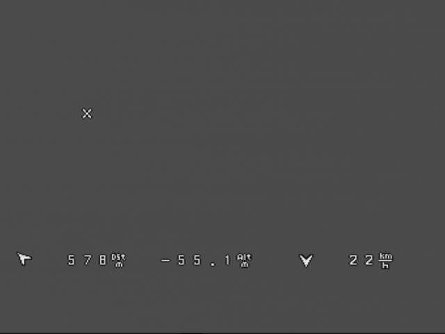
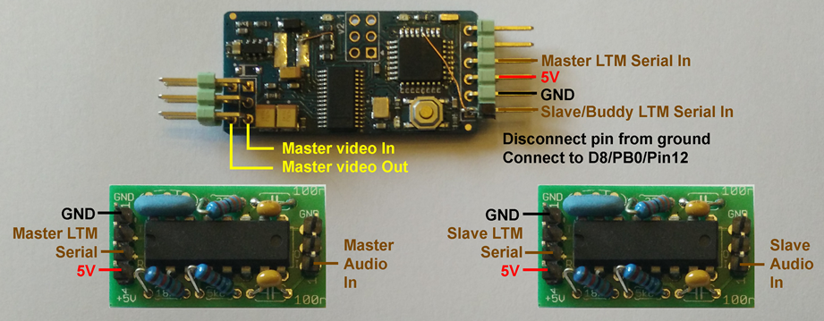
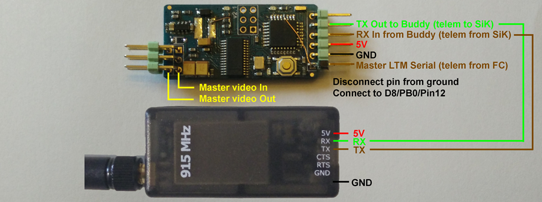

# BuddyOSD

* Minimosd software for ground buddy osd
* Hardware consist of (two) minimOSD boards with modification.
* Needs two LTM (Lite Telemetry) streams to work where the 'slave' plane is showed on the 'master' osd.
* In my case I used audiomodem https://github.com/kh4/FSK_modem more info here: https://www.dropbox.com/s/n315ybsf1p2nnxg/FSKv2%20assembly.pdf but alternative ways for this telemetry stream migth be used as this hardware is depriciated.
* LTM telemetry is readly available in iNav, setted up in a few clicks.
* **Hurray, this should be a working version!** Pictures/video's of proof of concept will be added.
* **It's not a ground OSD in a way that it does not show regular OSD features, only overlays 'friend's plane'**
* [Example gif](/docs/img/Overlay.gif) and [Example video](/docs/img/Example.mp4)]

More information about Light Telemetry: https://github.com/iNavFlight/inav/wiki/Lightweight-Telemetry-(LTM)

## Support

### Hardware - Ground based FSK Modem LTM telemetry approach

A wiring diagram is like this:

The required parts are:
* MinimOSD hardware (x2 if both users want buddyOSD)
* Means to transport LTM telemetry to the ground. The presented solution is an audiomodem to encode/decode LTM telemetry in the aircraft and on the ground. You need at least 4 of these FKSmodemv3. Other solutions, like telemetry over RC link using openLRSng is also a valid way to make this work.

LTM telemetry coming from the (iNav) FC is fed to the MinimOSD hardware (over the FSKModem) at 2400 baud.

### Hardware - Air based SiK telemetry

A wiring diagram is like this:

The required parts are:
* MinimOSD hardware x2 (for both users)
* SiK telemetry set

LTM telemetry coming from the (iNav) FC is fed to the MinimOSD hardware at 9600 baud, this can be set up within the limits of arduino's softserial baud rate.
The SiK telemetry baud rate is set at 57600 baud. Redestribution of telemetry from the FC happens over the microcontroller in the MinimOSD hardware to the SiK telemetry hardware.
**This approach should be much easier to get up and running**

## Open Source

This fork is software that is **open source** and is available free of charge without warranty to all users.

The license is GPL3.

## Project/Fork History

Based on GhettOSD: https://github.com/KipK/Ghettostation
                
 - GhettOSD:      Minimosd software for ground osd within the Ghettostation.

 Updated LTM libraries: https://github.com/sppnk/LTM-Telemetry-OLED
 Updated MAX code from: https://github.com/ShikOfTheRa/scarab-osd